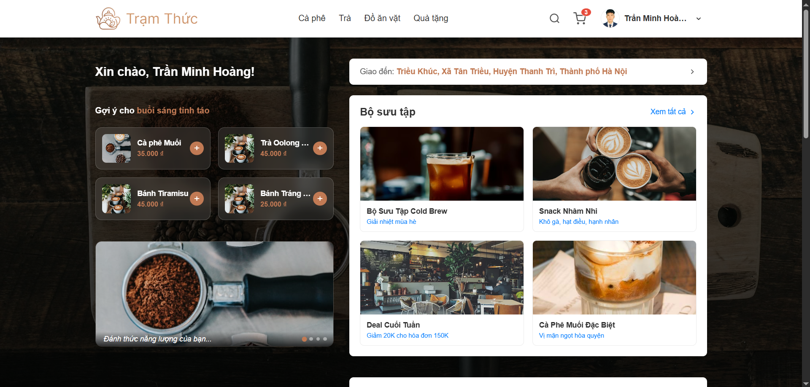

# 🍵 Trạm Thức - Hệ Thống Đặt Đồ Uống Trực Tuyến

 Trạm Thức là một ứng dụng thương mại điện tử chuyên cung cấp các loại đồ uống (Cà phê, Trà), đồ ăn vặt và quà tặng. Dự án được xây dựng theo kiến trúc **Microservices** linh hoạt, kết hợp giao diện người dùng hiện đại, mang lại trải nghiệm mua sắm mượt mà từ khâu chọn món đến khi thanh toán.

## ✨ Tính năng nổi bật

### 👤 Dành cho Khách hàng (Customer)

- **Khám phá & Tìm kiếm:** Duyệt sản phẩm theo danh mục, tìm kiếm thông minh kết hợp hiển thị kết quả real-time.
- **Giỏ hàng & Đặt hàng:** Quản lý giỏ hàng cục bộ, tính toán phí ship tự động dựa trên khoảng cách địa lý (tích hợp **Goong Map API**).
- **Thanh toán Đa dạng:** Hỗ trợ thanh toán khi nhận hàng (COD) và thanh toán trực tuyến qua cổng **VNPay**.
- **Quản lý Tài khoản:** Cập nhật thông tin cá nhân, thay đổi ảnh đại diện (tích hợp **Cloudinary**), quản lý sổ địa chỉ thông minh.
- **Bảo mật:** Xác thực tài khoản và các thao tác quan trọng bằng mã OTP.

### 🛡️ Dành cho Quản trị viên (Admin)

- **Dashboard Thống kê:** Bảng điều khiển tổng quan trực quan với các biểu đồ doanh thu, tỷ lệ món bán chạy (sử dụng **Recharts**).
- **Quản lý Đơn hàng:** Xem chi tiết, duyệt đơn, cập nhật trạng thái vận chuyển và thanh toán.
- **Quản lý Sản phẩm & Tồn kho:** Thêm, sửa, ẩn sản phẩm, kiểm soát số lượng tồn kho theo thời gian thực.

## 🛠️ Công nghệ sử dụng

Dự án được chia thành các service độc lập để dễ dàng mở rộng và bảo trì:

**1. Frontend (User & Admin Portal)**

- Framework: [Next.js](https://nextjs.org/) (React)
- Styling: CSS Modules, [Ant Design](https://ant.design/) (cho giao diện Admin)
- State Management: [Zustand](https://docs.pmnd.rs/zustand/getting-started/introduction)

**2. Backend (Microservices)**

- **Admin Service & Main API:** `Node.js` / `Express.js`
- **Auth Service:** `Java` / `Spring Boot` (Quản lý User, Address, OTP, Profile)
- **Payment Service:** `Java` / `Spring Boot` (Xử lý Đơn hàng, Tồn kho, VNPay)

**3. Cơ sở dữ liệu & Third-party Services**

- Database: **MySQL**
- Mapping & Routing: **Goong Map API** (Gợi ý địa chỉ, tính phí ship)
- Storage: **Cloudinary** (Lưu trữ Avatar người dùng)
- Payment Gateway: **VNPay**

## 🚀 Hướng dẫn Cài đặt & Chạy dự án (Local)

### Yêu cầu hệ thống

- Node.js (v18+)
- Java (JDK 17+)
- MySQL (v8.0+)
- Maven

### Bước 1: Thiết lập Database

1. Tạo một database mới trong MySQL có tên `tramthuc`.
2. Import file SQL chứa cấu trúc bảng (nếu có) hoặc để Spring Boot tự động tạo bảng thông qua Hibernate.

### Bước 2: Thiết lập Backend (Spring Boot & Node.js)

Bạn cần cấu hình các file biến môi trường (`application.properties` cho Java service hoặc `.env` cho NextJS main project) cho từng Service với các thông tin như sau:

- Thông tin kết nối MySQL (URL, Username, Password).
- Chuỗi cấu hình VNPay (`vnp_TmnCode`, `vnp_HashSecret`).
- Thông tin kết nối Cloudinary.

_Khởi chạy các service Backend trên các port tương ứng (Ví dụ: Node.js ở 10000, Auth Service ở 8080, Payment Service ở 8081)._

### Bước 3: Thiết lập Frontend (Next.js)

1. Di chuyển vào thư mục frontend: `cd frontend`
2. Cài đặt các gói phụ thuộc: `npm install`
3. Tạo file `.env.local` ở thư mục gốc của frontend và thêm các biến môi trường:

```env
NEXT_PUBLIC_API_URL=http://localhost:10000
NEXT_PUBLIC_AUTH_API_URL=http://localhost:8080
NEXT_PUBLIC_PAYMENT_API_URL=http://localhost:8081
NEXT_PUBLIC_GOONG_API_KEY=your_goong_api_key_here
```

4. Khởi chạy ứng dụng

```bash
npm run dev
```

5. Truy cập http://localhost:3000 để trải nghiệm

## 👨‍💻 Tác giả: Trần Minh Hoàng

Nếu bạn thấy dự án này thú vị, đừng quên cho mình 1 ⭐️ nhé!
